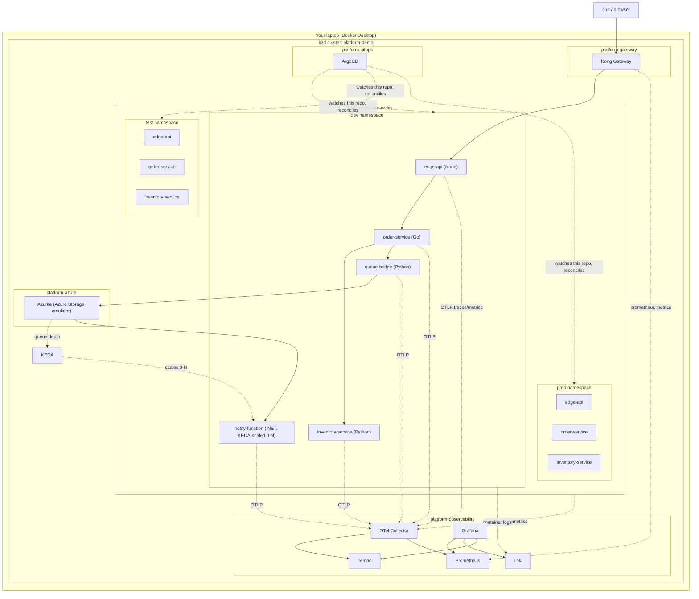

# Architecture

## Cluster topology

## Why namespaces, not three clusters

Real production platforms usually run dev/test/prod as fully separate
clusters (or at least separate node pools/cloud accounts) for blast-radius
isolation. This demo uses namespaces on one k3d cluster instead, purely
for laptop resource reasons - three full copies of Linkerd + Kong +
Prometheus + Loki + Tempo would need more CPU/RAM than most laptops have
to spare.

Crucially, the GitOps repo (`gitops/`) is structured as if the clusters
were already separate: each environment has its own ArgoCD Application
manifests and its own values files, and the only thing that currently
makes them share infrastructure is the `destination.server` field pointing
at the same cluster. See
[`scaling-to-multi-cluster.md`](scaling-to-multi-cluster.md) for the
one-line change to point `test`/`prod` at real separate clusters.

## Why one Helm chart for every service

`charts/service-template` is deliberately generic - every service, in
every language, in every environment, is a Deployment + Service + HPA +
PodDisruptionBudget + NetworkPolicy + ServiceMonitor + (optionally) an
HTTPRoute and a Linkerd ServiceProfile. A developer adding a new service
writes ~20 lines of values YAML, not a new set of Kubernetes manifests.
Infra/devops owns changes to the chart itself (enforced by
`.github/CODEOWNERS`); app teams own their values files. This is the
literal mechanism behind "shift-left, self-service deploys with
infra oversight" - the chart is the paved road, and the values file is the
only decision a developer has to make.

The one exception is `notify-function`, whose scaling model (KEDA,
0-to-N based on queue depth) is different enough from the standard
HPA-on-CPU pattern that it gets its own raw manifests
(`apps/notify-function-dotnet/k8s/`) rather than forcing that shape into
the shared chart. That's a judgment call worth surfacing in a review: not
every workload fits the same abstraction, and the platform should make
the common case easy without making the uncommon case impossible.