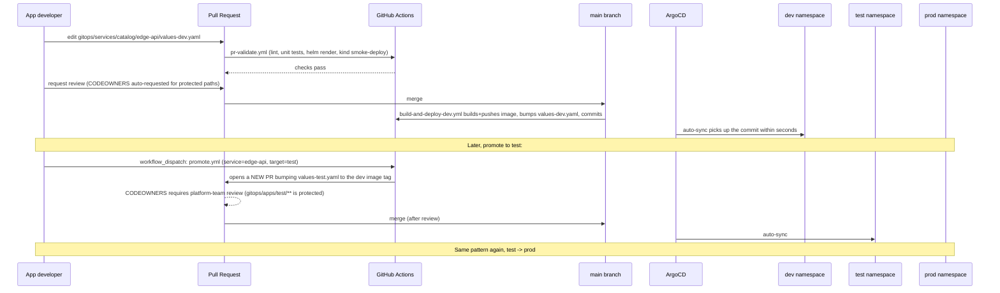

# GitOps Workflow: PR-Gated Promotion

## The mechanism

## What enforces "infra/devops oversight"

Two GitHub-native mechanisms, both already configured in this repo:

1. **`.github/CODEOWNERS`** - `gitops/apps/test/**`, `gitops/apps/prod/**`,
   `charts/**`, and every `values-test.yaml`/`values-prod.yaml` are owned
   by `@your-org/platform-team`. Combined with a branch protection rule
   requiring code owner review (GitHub Settings → Branches → main →
   *Require review from Code Owners*), nobody can merge a change to
   test/prod - or to the shared chart - without platform sign-off. `dev`
   values files are owned by each app team, so they can self-serve there.

2. **`.github/workflows/pr-validate.yml`** runs BEFORE a human ever looks
   at the PR: lint, unit tests, a Helm render of every values file (catches
   a typo'd values file before it becomes a broken deploy), and a
   server-side dry-run apply against a disposable kind cluster. A reviewer
   is reviewing intent and design, not syntax.

## Why ArgoCD's App-of-Apps

`gitops/bootstrap/root-app.tmpl.yaml` creates one root Application per
environment (`root-dev`, `root-test`, `root-prod`), each watching
`gitops/apps/<env>/` recursively. Every file ArgoCD finds there becomes
its own Application. Practically: adding a fifth service to dev is "add
one YAML file to `gitops/apps/dev/` and one values file to
`gitops/services/catalog/<service>/`, open a PR" - nothing about the
platform's bootstrapping changes.

Each per-service Application uses ArgoCD's multi-source feature: one
source points at the shared chart (`charts/service-template`), a second
`ref` source points at the same repo so `helm.valueFiles` can reference
`gitops/services/catalog/<service>/values-<env>.yaml` - a path outside the
chart's own directory. This is what lets one chart + one small values file
fully describe a service, instead of app teams maintaining copies of chart
templates.

## Rollback

Because every environment's desired state is a git commit, rollback is
`git revert` (or re-run `promote.yml` with an older tag) - ArgoCD's
`selfHeal: true` means it will actively converge the cluster back to
match, even undoing manual `kubectl edit` drift automatically. There is
deliberately no "rollback button" in ArgoCD to click during an incident -
the audit trail from a git revert is worth the extra 30 seconds.
